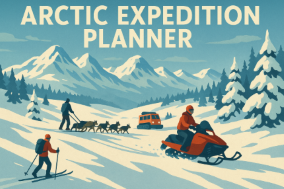
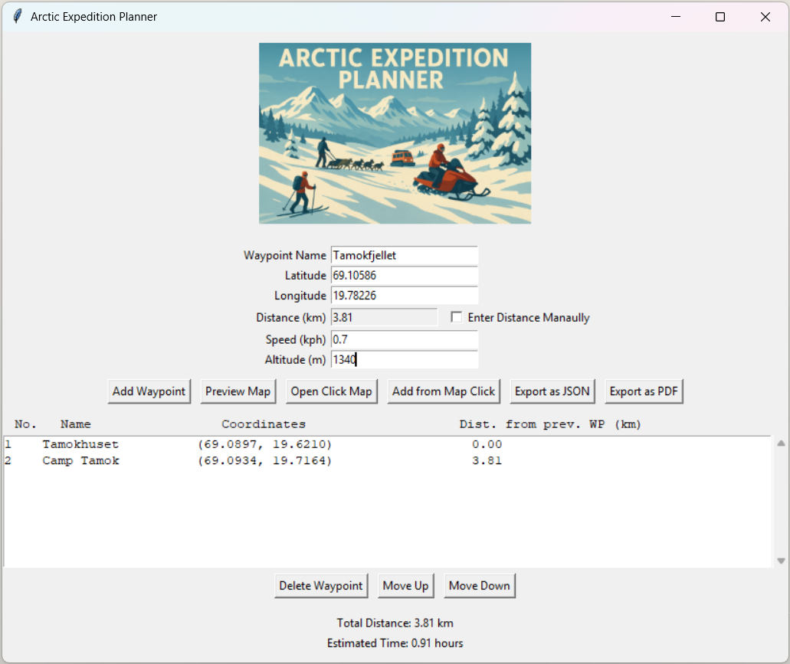
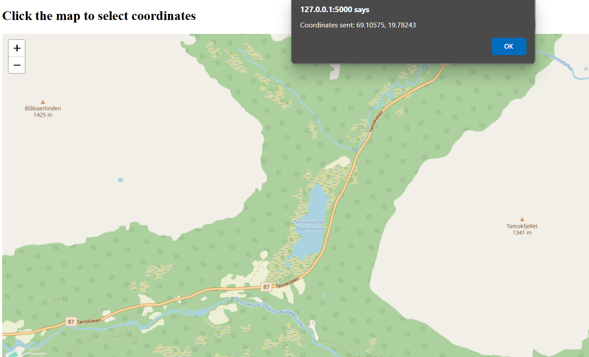
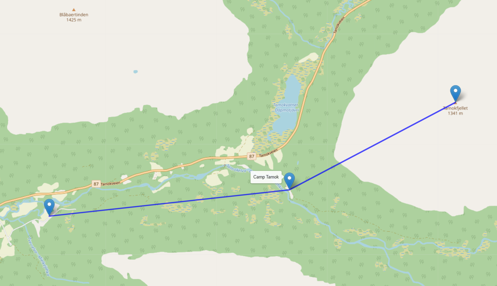
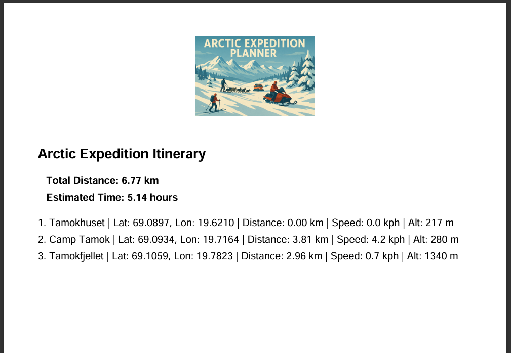


# 🧭 Arctic Expedition Planner


**A powerful, interactive desktop tool for planning Arctic expeditions with precision.**  
Built in Python with a GUI powered by Tkinter, this tool supports geolocation, route planning, altitude profiling, live map interaction, and exporting to PDF or JSON.

---

## 🌟 Features

- 📍 Add, reorder, or delete custom waypoints
- 🗺️ Click on an interactive map to select coordinates
- 🧮 Auto-calculates distances and estimated travel times
- ✏️ Optional manual distance overrides
- 📈 Displays live expedition statistics (distance, time)
- 🧾 Export full itinerary as **JSON** or **PDF** (with title image and summary)
- 🌐 Retrieves elevation using Open-Elevation API
- ✔️ Fully unit-tested with `unittest`

---

## 📸 Screenshots

| GUI Overview | Click Map | Preview Map | PDF Preview |
|-------------|-----------|-----------|----------------|
|  |  |  |  |

---

## 📁 Project Structure

```
ArcticExpeditionPlanner/
│
├── assets/                 # Header image, example JSON, screenshots
├── src/                   # Main application source
│   ├── gui.py             # Tkinter GUI
│   ├── planner.py         # Waypoint & itinerary logic
│   ├── export.py          # PDF/JSON export functions
│   ├── utils.py           # Coordinate validation & distance calc
│   └── map_click_server.py # Flask server for interactive map
│
├── tests/                 # Unit tests for all modules
├── requirements.txt
├── LICENSE.txt
└── README.md
```

---

## 🚀 Getting Started

### ✅ Prerequisites

- Windows 11 (or other OS with Python 3.10+)
- [Python 3.10+](https://www.python.org/downloads/)
- [Flask 2.3+](https://flask.palletsprojects.com/en/stable/installation/)
- [Requests 2.31+](https://pypi.org/project/requests/)
- [ReportLab 4.0+](https://pypi.org/project/reportlab/)

### 📦 Installation

1. Clone the repository:
   ```bash
   git clone https://github.com/ThisIsMikeyS/arctic-expedition-planner.git
   cd arctic-expedition-planner
   ```

2. (Optional) Create a virtual environment:
   ```bash
   python -m venv venv
   venv\Scripts\activate
   ```

3. Install required packages:
   ```bash
   pip install -r requirements.txt
   ```

---

## ▶️ Running the App

To start the GUI:
```bash
python src/gui.py
```

**Note:** Ensure you have internet access for elevation API and map click functionality.

---

## 🧪 Running Tests

To run the unit tests:
```bash
python -m unittest discover tests
```

Includes tests for:
- GUI logic
- Core planner logic
- Utility functions
- Export functionality

### Expected output:
```
..................
----------------------------------------------------------------------
Ran 18 tests in 0.730s

OK
```

---

## 💾 Sample Output (`example_itinerary.json`)
```json
{
  "itinerary": [
    {
      "name": "Base Camp",
      "latitude": 70.0000,
      "longitude": 20.0000,
      "distance_km": 0.0,
      "estimated_speed_kph": 8.0,
      "altitude_m": 150
    },
    {
      "name": "Glacier View",
      "latitude": 70.1000,
      "longitude": 20.2000,
      "distance_km": 12.5,
      "estimated_speed_kph": 10.0,
      "altitude_m": 300
    },
    {
      "name": "Aurora Point",
      "latitude": 70.2500,
      "longitude": 20.4500,
      "distance_km": 18.3,
      "estimated_speed_kph": 9.5,
      "altitude_m": 280
    }
  ]
}
```

---

## 🛠️ Future Improvements

- Elevation profile chart
- Offline map tile support
- Setting panel
- PDF report improvements (e.g. route map image)
- Bug fixing

---

## 📚 License

This project is licensed under the MIT License — see [LICENSE](LICENSE) for details.

---

## 🧑‍💻 Author

**Michael Saunders**  
Freelance Software & Systems Developer | Technical Writer  
[LinkedIn](https://www.linkedin.com/in/michael-saunders-805785128/) · [GitHub](https://github.com/ThisIsMikeyS)

---

## 🌐 Acknowledgments

- OpenStreetMap & Leaflet.js for map rendering
- Open-Elevation API for elevation lookups
- ReportLab for PDF generation
